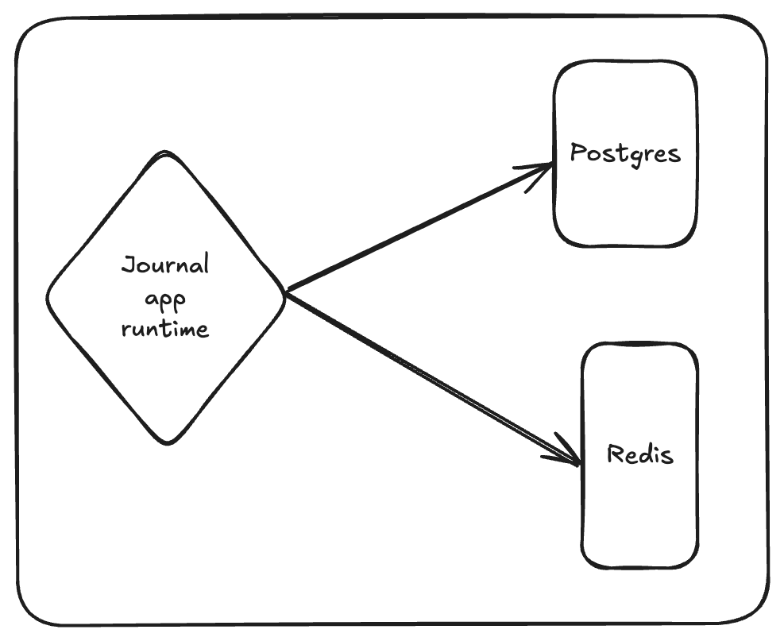

## Quickstart - Deploy Your First Application

This guide will help you get started with Sarabi by deploying a simple Java Spring Boot application. You'll learn how to deploy, scale, and configure database backups. Below are key points about Sarabi's application deployment process.

#### Application Architecture

The demo application is a journals app with two API endpoints:
- **Save Journal**: Stores journals in a PostgreSQL database with a throttling mechanism (1 journal per minute) to demonstrate Redis integration.
- **Retrieve Journals**: Fetches saved journals from the database.



:::note[Key Notes]

1. **Dockerfile**: Every application must include a Dockerfile. Sarabi uses it to build a Docker image and deploy the app.
2. **Automatic Database Connection Injection**:
    - During app creation, select the databases you need (e.g., PostgreSQL, Redis).
    - Sarabi provisions the databases and injects connection parameters (e.g., `POSTGRESQL_DATABASE_URL`, `REDIS_DATABASE_URL`) into your app via environment variables.
    - If your app doesn't use environment variables for database connections or general configuration, you may need to adjust your code.
3. **Domain Name**:
   - You need a domain name with a `A` record pointing to your VPS IP address.
   - When you deploy an application, it will be automatically accessible at:  
     `https://{env-name-instance-type.yourdomain.com}`  
     For example, if your domain is `journalapps.dev` and you deploy to an environment named `dev`, the app will be exposed at:  
     `https://backend-dev.journalapps.dev`. Note: you will be able to modify this domain name to a custom one later and you can add as many as you want!
:::
#### Installing Sarabi CLI
```shell
curl curl https://github.com/adxgun/sarabi/install_cli.sh | sh
```

#### Verifying Installation
```shell
sarabi version
```

#### Creating our journal app!
First, clone the journal app from [HERE](https://github.com/adxgun/spring-journal). Navigate to the root directory and execute `sarabi apps create`, this will launch the app creation prompts just like the video/gif below 

